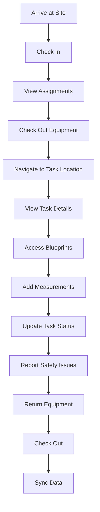
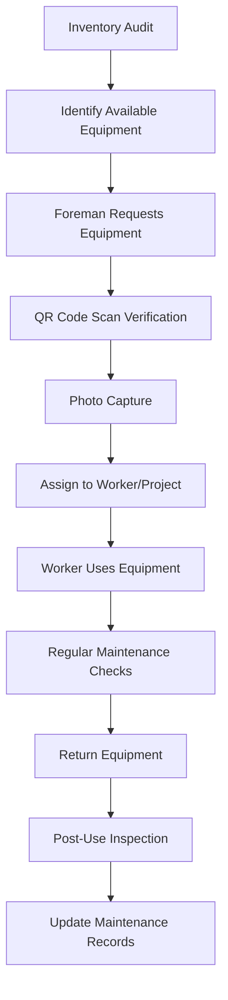
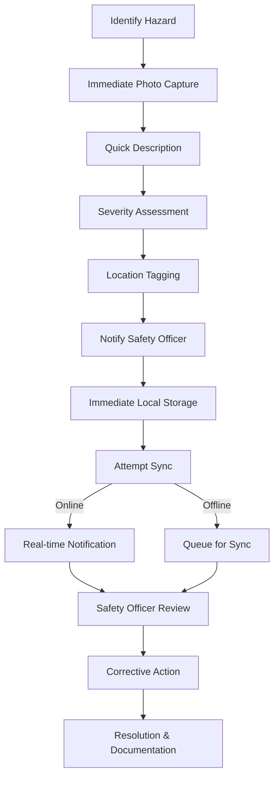

# CortexBuild Pro Construction-Focused Design Specification

**Date:** 2026-05-10  
**Project:** CortexBuild Pro Construction Management SaaS  
**Approach:** Construction-Focused, Offline-First Implementation  
**Status:** Revised Draft for Review  
**Replaces:** 2026-05-10-foundation-first-design.md

---

## Executive Summary

This **revised specification** addresses the unique needs of construction management by incorporating:

- **Construction-specific features** (blueprints, equipment, location tracking)
- **Offline-first architecture** for job site reliability  
- **Revised implementation approach** delivering user value earlier
- **Enhanced risk management** with construction workflow validation

**Key Improvements Over Previous Design:**
- ✅ Construction-specific functionality prioritized
- ✅ Offline-first strategy with robust sync
- ✅ More realistic phased approach
- ✅ Better risk management
- ✅ User feedback loops integrated

---

## 1. Construction-Specific Backend Design

### 1.1 Enhanced Supabase Schema

**New Construction-Specific Tables:**

```sql
-- organisations (enhanced)
CREATE TABLE organisations (
  id uuid PRIMARY KEY DEFAULT gen_random_uuid(),
  name text NOT NULL,
  slug text UNIQUE NOT NULL,
  plan text DEFAULT 'free',
  industry text, -- construction, electrical, plumbing, etc.
  company_size text, -- small, medium, large
  created_at timestamptz DEFAULT now(),
  updated_at timestamptz DEFAULT now()
);

-- projects (construction-enhanced)
CREATE TABLE projects (
  id uuid PRIMARY KEY DEFAULT gen_random_uuid(),
  name text NOT NULL,
  description text,
  status text DEFAULT 'planning', -- planning, active, on_hold, completed, archived
  location jsonb, -- { address, lat, lng, site_plan_url }
  start_date date,
  end_date date,
  budget numeric,
  budget_currency text DEFAULT 'USD',
  project_type text, -- residential, commercial, industrial, infrastructure
  square_footage numeric,
  permit_number text,
  permit_expiry date,
  org_id uuid REFERENCES organisations(id) ON DELETE CASCADE,
  created_at timestamptz DEFAULT now(),
  updated_at timestamptz DEFAULT now()
);

-- NEW: equipment
CREATE TABLE equipment (
  id uuid PRIMARY KEY DEFAULT gen_random_uuid(),
  name text NOT NULL,
  type text, -- excavator, crane, scaffolding, etc.
  serial_number text,
  purchase_date date,
  last_maintenance date,
  maintenance_interval_days integer,
  status text DEFAULT 'available', -- available, in_use, maintenance, broken
  current_project_id uuid REFERENCES projects(id),
  current_assignee_id uuid REFERENCES auth.users(id),
  org_id uuid REFERENCES organisations(id) ON DELETE CASCADE,
  created_at timestamptz DEFAULT now(),
  updated_at timestamptz DEFAULT now()
);

-- NEW: blueprints
CREATE TABLE blueprints (
  id uuid PRIMARY KEY DEFAULT gen_random_uuid(),
  project_id uuid REFERENCES projects(id) ON DELETE CASCADE,
  name text NOT NULL,
  file_url text NOT NULL,
  file_type text, -- pdf, dwg, dxf, image
  version text,
  revision_date timestamptz DEFAULT now(),
  uploaded_by uuid REFERENCES auth.users(id),
  created_at timestamptz DEFAULT now()
);

-- NEW: blueprint_annotations
CREATE TABLE blueprint_annotations (
  id uuid PRIMARY KEY DEFAULT gen_random_uuid(),
  blueprint_id uuid REFERENCES blueprints(id) ON DELETE CASCADE,
  x numeric NOT NULL,
  y numeric NOT NULL,
  width numeric,
  height numeric,
  content text,
  type text, -- measurement, note, issue, change_order
  color text,
  created_by uuid REFERENCES auth.users(id),
  created_at timestamptz DEFAULT now(),
  resolved boolean DEFAULT false,
  resolved_at timestamptz,
  resolved_by uuid REFERENCES auth.users(id)
);

-- tasks (construction-enhanced)
CREATE TABLE tasks (
  id uuid PRIMARY KEY DEFAULT gen_random_uuid(),
  project_id uuid REFERENCES projects(id) ON DELETE CASCADE,
  title text NOT NULL,
  description text,
  status text DEFAULT 'todo', -- todo, in_progress, review, done, blocked
  priority text DEFAULT 'medium', -- low, medium, high, critical
  assignee_id uuid REFERENCES auth.users(id),
  due_date date,
  estimated_hours numeric,
  actual_hours numeric,
  trade_required text, -- electrical, plumbing, carpentry, etc.
  location_zone text, -- site zone/area reference
  requires_equipment text[], -- equipment IDs
  safety_requirements text[], -- ppe, permits, etc.
  blueprint_reference text, -- reference to specific blueprint section
  created_at timestamptz DEFAULT now(),
  updated_at timestamptz DEFAULT now()
);

-- safety_incidents (enhanced)
CREATE TABLE safety_incidents (
  id uuid PRIMARY KEY DEFAULT gen_random_uuid(),
  project_id uuid REFERENCES projects(id) ON DELETE CASCADE,
  title text NOT NULL,
  description text,
  severity text DEFAULT 'minor', -- minor, moderate, serious, critical
  status text DEFAULT 'open', -- open, investigating, resolved, closed
  reported_by uuid REFERENCES auth.users(id),
  location jsonb, -- { address, lat, lng, zone }
  incident_type text, -- fall, equipment, electrical, chemical, etc.
  photos text[], -- array of photo URLs
  immediate_action_taken text,
  corrective_action_required text,
  osha_reportable boolean DEFAULT false,
  created_at timestamptz DEFAULT now(),
  resolved_at timestamptz
);

-- team_members (construction-enhanced)
CREATE TABLE team_members (
  id uuid PRIMARY KEY DEFAULT gen_random_uuid(),
  org_id uuid REFERENCES organisations(id) ON DELETE CASCADE,
  user_id uuid REFERENCES auth.users(id),
  role text DEFAULT 'worker', -- worker, foreman, supervisor, safety_officer, admin
  trade text, -- electrical, plumbing, carpentry, etc.
  certifications text[], -- osha_30, first_aid, etc.
  hourly_rate numeric,
  emergency_contact_name text,
  emergency_contact_phone text,
  safety_training_completed timestamptz,
  safety_training_expiry timestamptz
);
```

### 1.2 Construction-Specific API Endpoints

**New Endpoints:**

```typescript
// Equipment Management
GET    /equipment              # List all equipment
POST   /equipment              # Add new equipment
GET    /equipment/:id          # Get equipment details
PUT    /equipment/:id          # Update equipment
POST   /equipment/:id/check-in # Check in equipment
POST   /equipment/:id/check-out # Check out to project/user

// Blueprint Management
GET    /projects/:id/blueprints          # List project blueprints
POST   /projects/:id/blueprints          # Upload blueprint
GET    /blueprints/:id                  # Get blueprint details
GET    /blueprints/:id/annotations      # Get annotations
POST   /blueprints/:id/annotations      # Add annotation
PUT    /annotations/:id                # Update annotation

// Location Services
POST   /projects/:id/check-in           # Worker check-in at site
POST   /projects/:id/check-out          # Worker check-out
GET    /projects/:id/on-site             # Who's currently on site

// Safety & Compliance
GET    /projects/:id/safety-checklist   # OSHA compliance checklist
POST   /safety-incidents/:id/osha-report # Generate OSHA report
GET    /team-members/safety-certifications # Expiring certifications
```

### 1.3 Offline-First Data Synchronization

**Synchronization Strategy:**

```typescript
// Offline Queue Structure
type OfflineOperation = {
  id: string;
  type: 'create' | 'update' | 'delete';
  table: string;
  data: any;
  timestamp: string;
  retry_count: number;
  status: 'pending' | 'syncing' | 'completed' | 'failed';
  last_error?: string;
};

// Sync Manager
class OfflineSyncManager {
  private queue: OfflineOperation[] = [];
  private isSyncing = false;
  
  async addOperation(operation: Omit<OfflineOperation, 'id' | 'timestamp' | 'retry_count' | 'status'>) {
    const op: OfflineOperation = {
      id: uuidv4(),
      timestamp: new Date().toISOString(),
      retry_count: 0,
      status: 'pending',
      ...operation
    };
    
    // Store in local database
    await localDB.offlineOperations.put(op);
    this.queue.push(op);
    
    if (!this.isSyncing && (await this.checkConnectivity())) {
      this.startSync();
    }
  }
  
  async startSync() {
    if (this.isSyncing) return;
    
    this.isSyncing = true;
    
    while (this.queue.length > 0) {
      const op = this.queue[0];
      
      try {
        // Check connectivity
        if (!(await this.checkConnectivity())) {
          this.isSyncing = false;
          return;
        }
        
        // Execute operation
        switch (op.type) {
          case 'create':
            await supabase.from(op.table).insert(op.data);
            break;
          case 'update':
            await supabase.from(op.table).update(op.data).eq('id', op.data.id);
            break;
          case 'delete':
            await supabase.from(op.table).delete().eq('id', op.data.id);
            break;
        }
        
        // Mark as completed
        op.status = 'completed';
        await localDB.offlineOperations.put(op);
        this.queue.shift();
        
      } catch (error) {
        op.retry_count++;
        op.status = 'failed';
        op.last_error = error.message;
        
        if (op.retry_count >= MAX_RETRIES) {
          // Notify user of persistent failure
          this.notifySyncError(op);
          this.queue.shift();
        } else {
          // Exponential backoff
          await new Promise(resolve => 
            setTimeout(resolve, RETRY_DELAY * op.retry_count)
          );
        }
        
        await localDB.offlineOperations.put(op);
      }
    }
    
    this.isSyncing = false;
  }
}
```

### 1.4 Enhanced RLS Policies for Construction

**Construction-Specific Policies:**

```sql
-- Equipment access based on role and project
CREATE POLICY "Equipment access for project members"
ON equipment
FOR SELECT
USING (
  current_project_id IS NULL OR 
  current_project_id IN (
    SELECT id FROM projects 
    WHERE org_id IN (
      SELECT org_id FROM team_members WHERE user_id = auth.uid()
    )
  )
);

CREATE POLICY "Equipment checkout restricted to foremen+"
ON equipment
FOR UPDATE
USING (
  auth.uid() IN (
    SELECT user_id FROM team_members 
    WHERE role IN ('foreman', 'supervisor', 'admin')
  )
);

-- Blueprint access
CREATE POLICY "Blueprint access for project team"
ON blueprints
FOR ALL
USING (
  project_id IN (
    SELECT id FROM projects 
    WHERE org_id IN (
      SELECT org_id FROM team_members WHERE user_id = auth.uid()
    )
  )
);

-- Safety incident reporting
CREATE POLICY "Anyone can report safety incidents"
ON safety_incidents
FOR INSERT
USING (
  project_id IN (
    SELECT id FROM projects 
    WHERE org_id IN (
      SELECT org_id FROM team_members WHERE user_id = auth.uid()
    )
  )
);

CREATE POLICY "Only safety officers can resolve incidents"
ON safety_incidents
FOR UPDATE
USING (
  project_id IN (
    SELECT id FROM projects 
    WHERE org_id IN (
      SELECT org_id FROM team_members WHERE user_id = auth.uid()
    )
  ) AND (
    auth.uid() IN (
      SELECT user_id FROM team_members 
      WHERE role IN ('safety_officer', 'supervisor', 'admin')
    ) OR 
    reported_by = auth.uid() -- Allow reporter to update their own reports
  )
);
```

---

## 2. Construction-Specific UI/UX Design

### 2.1 Construction-Optimized Component Library

**New Construction Components:**

```
src/
  components/
    construction/          # Construction-specific components
      EquipmentCard.tsx    # Equipment status and assignment
      BlueprintViewer.tsx   # Interactive blueprint viewer
      SafetyChecklist.tsx   # OSHA compliance checklist
      LocationSelector.tsx # Site zone/area selector
      TradeBadge.tsx        # Worker trade specialization badge
      PPERequirements.tsx   # Personal protective equipment indicators
      
    forms/
      MeasurementInput.tsx # Feet/inches, meters, etc.
      EquipmentSelector.tsx # Equipment assignment
      TradeSelector.tsx     # Trade specialization selection
      SafetyChecklistForm.tsx # OSHA compliance form
```

### 2.2 Screen-Specific Construction Enhancements

**Enhanced Dashboard (`app/(tabs)/index.tsx`):**
- **On-Site Workers**: Who's currently checked in at each project
- **Equipment Status**: Availability and maintenance alerts
- **Safety Alerts**: Open incidents requiring attention
- **Permit Expiry**: Upcoming permit renewals
- **Weather Alerts**: Local weather conditions affecting sites

**Projects Screen (`app/(tabs)/projects.tsx`):**
- **Site Maps**: Interactive project location maps
- **Blueprint Previews**: Thumbnail previews of project blueprints
- **Equipment Assignment**: Visual indicators of equipment allocation
- **Safety Status**: Project safety compliance indicators
- **Permit Status**: Permit validity indicators

**Tasks Screen (`app/(tabs)/tasks.tsx`):**
- **Trade Filtering**: Filter by required trade specialization
- **Equipment Requirements**: Visual indicators for required equipment
- **Location Zones**: Site zone/area filtering
- **Safety Requirements**: PPE and permit indicators
- **Blueprint References**: Quick access to related blueprints

**NEW: Equipment Screen (`app/(tabs)/equipment.tsx`):**
- **Equipment Inventory**: Searchable list with status filters
- **Maintenance Schedule**: Upcoming maintenance alerts
- **Check-In/Out**: QR code scanning for equipment tracking
- **Location Tracking**: GPS-based equipment location
- **Utilization Reports**: Equipment usage analytics

**NEW: Blueprints Screen (`app/project/[id]/blueprints.tsx`):**
- **Interactive Viewer**: Zoom, pan, measure tools
- **Annotation Layers**: Issue tracking and markups
- **Version History**: Blueprint revision tracking
- **Offline Access**: Cached blueprints for job sites
- **Collaboration**: Real-time annotation updates

### 2.3 Offline-First UI Patterns

**Offline State Indicators:**
```typescript
// src/components/OfflineIndicator.tsx
export function OfflineIndicator() {
  const { isConnected } = useNetInfo();
  const [pendingOperations] = useOfflineQueue();
  
  if (isConnected && pendingOperations.length === 0) return null;
  
  return (
    <View className="absolute bottom-4 left-4 right-4 bg-yellow-500 p-3 rounded-lg flex-row items-center justify-between z-50">
      <View className="flex-row items-center gap-2">
        {isConnected ? (
          <ActivityIndicator color="#000" />
        ) : (
          <WifiOff className="text-black" size={20} />
        )}
        <Text className="font-medium text-black">
          {isConnected 
            ? `Syncing ${pendingOperations.length} changes...`
            : 'Working offline - changes will sync when connected'}
        </Text>
      </View>
      {pendingOperations.length > 0 && (
        <Button 
          variant="ghost" 
          size="sm" 
          onPress={() => forceSync()}
          className="bg-black/10"
        >
          <Text className="text-black">Sync Now</Text>
        </Button>
      )}
    </View>
  );
}
```

**Data Stale Indicators:**
```typescript
// src/components/StaleDataIndicator.tsx
export function StaleDataIndicator({ lastSynced }: { lastSynced: Date }) {
  const hoursStale = (Date.now() - lastSynced.getTime()) / (1000 * 60 * 60);
  
  if (hoursStale < 1) return null;
  
  return (
    <View className="flex-row items-center gap-1">
      <Clock className="text-gray-500" size={14} />
      <Text className="text-xs text-gray-500">
        Data from {formatDistanceToNow(lastSynced, { addSuffix: true })}
      </Text>
    </View>
  );
}
```

### 2.4 Construction-Specific Form Enhancements

**Trade-Specific Inputs:**
```typescript
// src/components/forms/TradeSelector.tsx
const TRADES = [
  { value: 'general', label: 'General Labor' },
  { value: 'electrical', label: 'Electrical' },
  { value: 'plumbing', label: 'Plumbing' },
  { value: 'hvac', label: 'HVAC' },
  { value: 'carpentry', label: 'Carpentry' },
  { value: 'masonry', label: 'Masonry' },
  { value: 'roofing', label: 'Roofing' },
  { value: 'drywall', label: 'Drywall' },
  { value: 'painting', label: 'Painting' },
  { value: 'concrete', label: 'Concrete' },
  { value: 'welding', label: 'Welding' },
  { value: 'excavation', label: 'Excavation' }
];

export function TradeSelector({ value, onChange }: { value: string; onChange: (value: string) => void }) {
  return (
    <Select value={value} onValueChange={onChange}>
      <SelectTrigger>
        <SelectValue placeholder="Select trade" />
      </SelectTrigger>
      <SelectContent>
        {TRADES.map(trade => (
          <SelectItem key={trade.value} value={trade.value}>
            {trade.label}
          </SelectItem>
        ))}
      </SelectContent>
    </Select>
  );
}
```

**Measurement Inputs:**
```typescript
// src/components/forms/MeasurementInput.tsx
export function MeasurementInput({ 
  value, 
  onChange, 
  unit = 'feet-inches'
}: {
  value: string;
  onChange: (value: string) => void;
  unit?: 'feet-inches' | 'meters' | 'yards';
}) {
  const [feet, inches] = value.split('-') || ['', ''];
  
  const handleFeetChange = (f: string) => {
    onChange(`${f}-${inches || '0'}`);
  };
  
  const handleInchesChange = (i: string) => {
    onChange(`${feet || '0'}-${i}`);
  };
  
  return (
    <View className="flex-row items-center gap-2">
      <Input
        className="flex-1"
        keyboardType="numeric"
        placeholder="Feet"
        value={feet}
        onChangeText={handleFeetChange}
      />
      <Text className="text-xl">'</Text>
      <Input
        className="w-16"
        keyboardType="numeric"
        placeholder="In"
        value={inches}
        onChangeText={handleInchesChange}
        maxLength={2}
      />
      <Text className="text-xl">"</Text>
    </View>
  );
}
```

---

## 3. Offline-First Performance Optimization

### 3.1 Data Caching Strategy

**Multi-Layer Caching:**

```typescript
// src/lib/cache.ts
export const cache = {
  // Memory cache (immediate access)
  memory: {
    projects: null as Project[] | null,
    tasks: null as Task[] | null,
    equipment: null as Equipment[] | null,
    lastUpdated: 0
  },
  
  // Disk cache (persistent across sessions)
  async getProjects(orgId: string): Promise<Project[] | null> {
    // 1. Check memory cache
    if (this.memory.projects && this.isMemoryCacheValid()) {
      return this.memory.projects;
    }
    
    // 2. Check local database
    try {
      const cached = await localDB.projects.where('orgId').equals(orgId).toArray();
      if (cached.length > 0) {
        this.memory.projects = cached;
        this.memory.lastUpdated = Date.now();
        return cached;
      }
    } catch (error) {
      console.warn('Local DB error:', error);
    }
    
    // 3. Fetch from network
    return null;
  },
  
  async setProjects(data: Project[], orgId: string) {
    // Update memory cache
    this.memory.projects = data;
    this.memory.lastUpdated = Date.now();
    
    // Update disk cache
    try {
      await localDB.projects.clear();
      await localDB.projects.bulkPut(data.map(p => ({ ...p, orgId })));
    } catch (error) {
      console.warn('Local DB write error:', error);
    }
  },
  
  isMemoryCacheValid(): boolean {
    return Date.now() - this.memory.lastUpdated < CACHE_TTL;
  },
  
  invalidateCache() {
    this.memory.lastUpdated = 0;
  }
};
```

### 3.2 Offline Queue Management

**Priority-Based Sync:**

```typescript
// src/lib/offlineQueue.ts
export class OfflineQueue {
  private queue: OfflineOperation[] = [];
  private syncTimeout: NodeJS.Timeout | null = null;
  
  addOperation(operation: Omit<OfflineOperation, 'id' | 'timestamp' | 'retry_count' | 'status'>) {
    const op: OfflineOperation = {
      id: uuidv4(),
      timestamp: new Date().toISOString(),
      retry_count: 0,
      status: 'pending',
      ...operation
    };
    
    // Prioritize by operation type
    const priority = this.getPriority(op);
    
    // Insert in priority order
    const insertIndex = this.queue.findIndex(existing => 
      this.getPriority(existing) < priority
    );
    
    if (insertIndex === -1) {
      this.queue.push(op);
    } else {
      this.queue.splice(insertIndex, 0, op);
    }
    
    // Persist to local storage
    localDB.offlineOperations.put(op);
    
    // Trigger sync if connected
    this.attemptSync();
  }
  
  private getPriority(op: OfflineOperation): number {
    // Priority order: safety > equipment > tasks > other
    switch (op.table) {
      case 'safety_incidents': return 100;
      case 'equipment': return 80;
      case 'tasks': return 60;
      case 'projects': return 40;
      default: return 20;
    }
  }
  
  private async attemptSync() {
    if (this.syncTimeout) {
      clearTimeout(this.syncTimeout);
    }
    
    // Debounce sync attempts
    this.syncTimeout = setTimeout(async () => {
      if (await checkConnectivity()) {
        await this.processQueue();
      }
    }, SYNC_DEBOUNCE_DELAY);
  }
  
  private async processQueue() {
    if (this.queue.length === 0) return;
    
    const op = this.queue[0];
    
    try {
      // Execute with exponential backoff
      await this.executeWithRetry(op);
      
      // Remove from queue on success
      this.queue.shift();
      await localDB.offlineOperations.delete(op.id);
      
      // Process next item
      this.processQueue();
      
    } catch (error) {
      op.retry_count++;
      op.last_error = error.message;
      
      if (op.retry_count >= MAX_RETRIES) {
        this.queue.shift();
        await localDB.offlineOperations.delete(op.id);
        this.notifyFailure(op);
      } else {
        // Update in database
        await localDB.offlineOperations.put(op);
        
        // Wait before retry
        await new Promise(resolve => 
          setTimeout(resolve, RETRY_DELAY * op.retry_count)
        );
        
        // Retry
        this.processQueue();
      }
    }
  }
}
```

### 3.3 Conflict Resolution Strategy

**Construction-Specific Conflict Handling:**

```typescript
// src/lib/conflictResolver.ts
export function resolveConflict(
  localOp: OfflineOperation,
  remoteData: any
): any {
  switch (localOp.table) {
    case 'tasks':
      return resolveTaskConflict(localOp.data, remoteData);
    
    case 'equipment':
      return resolveEquipmentConflict(localOp.data, remoteData);
    
    case 'safety_incidents':
      return resolveSafetyConflict(localOp.data, remoteData);
    
    default:
      // Last write wins for most cases
      return localOp.timestamp > remoteData.updated_at 
        ? localOp.data 
        : remoteData;
  }
}

function resolveTaskConflict(local: Task, remote: Task): Task {
  // Safety: if task marked complete remotely but local has hours logged, merge
  if (remote.status === 'done' && local.actual_hours && local.actual_hours > 0) {
    return {
      ...remote,
      actual_hours: local.actual_hours,
      updated_at: new Date().toISOString()
    };
  }
  
  // Status changes: remote wins unless local is more "complete"
  const statusPriority = { todo: 1, in_progress: 2, review: 3, done: 4 };
  if (statusPriority[local.status] > statusPriority[remote.status]) {
    return local;
  }
  
  // Last write wins
  return local.timestamp > remote.updated_at ? local : remote;
}

function resolveEquipmentConflict(local: Equipment, remote: Equipment): Equipment {
  // Check-in/check-out: remote wins to prevent double booking
  if (local.current_project_id !== remote.current_project_id) {
    return remote; // Remote assignment takes precedence
  }
  
  // Maintenance updates: most recent wins
  if (local.last_maintenance !== remote.last_maintenance) {
    const localDate = new Date(local.last_maintenance || 0);
    const remoteDate = new Date(remote.last_maintenance || 0);
    return localDate > remoteDate ? local : remote;
  }
  
  return local.timestamp > remote.updated_at ? local : remote;
}

function resolveSafetyConflict(local: SafetyIncident, remote: SafetyIncident): SafetyIncident {
  // Safety incidents: most severe wins
  const severityPriority = { minor: 1, moderate: 2, serious: 3, critical: 4 };
  if (severityPriority[local.severity] > severityPriority[remote.severity]) {
    return local;
  }
  
  // Resolution: if one is resolved and other isn't, resolved wins
  if (local.resolved_at !== remote.resolved_at) {
    return local.resolved_at ? local : remote;
  }
  
  // Merge photos from both
  const allPhotos = [...new Set([
    ...(local.photos || []),
    ...(remote.photos || [])
  ])];
  
  return {
    ...(local.timestamp > remote.updated_at ? local : remote),
    photos: allPhotos
  };
}
```

### 3.4 Performance Monitoring for Construction

**Construction-Specific Metrics:**

```typescript
// src/lib/constructionMonitoring.ts
export function setupConstructionMonitoring() {
  // Track app usage patterns
  trackScreenViews();
  trackFeatureUsage();
  
  // Monitor performance
  monitorSyncPerformance();
  monitorBlueprintLoading();
  monitorEquipmentCheckout();
  
  // Construction-specific events
  monitorOfflineUsage();
  monitorLocationServices();
  monitorSafetyCompliance();
}

function monitorSyncPerformance() {
  // Track sync times and success rates
  analytics.trackSyncAttempt = (success, duration, operationCount) => {
    analytics.track('SyncAttempt', {
      success,
      duration,
      operationCount,
      networkType: getNetworkType()
    });
  };
}

function monitorBlueprintLoading() {
  // Track blueprint performance
  analytics.trackBlueprintLoad = (blueprintId, sizeMB, loadTime, cacheHit) => {
    analytics.track('BlueprintLoad', {
      blueprintId,
      sizeMB,
      loadTime,
      cacheHit,
      deviceModel: Device.modelName
    });
  };
}

function monitorOfflineUsage() {
  // Track offline patterns
  useNetInfo().addEventListener(state => {
    analytics.track('ConnectivityChange', {
      isConnected: state.isConnected,
      connectionType: state.type,
      timestamp: new Date().toISOString()
    });
  });
}
```

---

## 4. Revised Implementation Plan

### Phase 1: Task Management Foundation (Week 1)

**Focus:** Deliver complete, working task management with offline support

**Backend:**
- [ ] Implement auth system
- [ ] Create tasks table with construction fields
- [ ] Basic RLS policies for tasks
- [ ] Offline sync endpoint
- [ ] Conflict resolution for tasks

**UI/UX:**
- [ ] Task list with construction filters
- [ ] Task detail view with trade/equipment fields
- [ ] Task creation form with measurement inputs
- [ ] Offline indicators and sync status
- [ ] Safety requirement indicators

**Performance:**
- [ ] Task list optimization (FlatList)
- [ ] Offline queue implementation
- [ ] Basic caching for tasks
- [ ] Conflict resolution logic
- [ ] Sync performance monitoring

**Deliverables:**
✅ Working task management system  
✅ Offline capability for tasks  
✅ Construction-specific task fields  
✅ Basic sync and conflict resolution  

### Phase 2: Project & Equipment Integration (Week 2)

**Focus:** Core construction workflows with equipment tracking

**Backend:**
- [ ] Projects table with construction fields
- [ ] Equipment table and management
- [ ] Project-equipment relationships
- [ ] Location services for check-in/out
- [ ] Enhanced RLS for projects/equipment

**UI/UX:**
- [ ] Project list with blueprint previews
- [ ] Project detail with equipment assignment
- [ ] Equipment inventory screen
- [ ] Check-in/out workflow
- [ ] Location-based features

**Performance:**
- [ ] Project data caching
- [ ] Equipment list optimization
- [ ] Location service efficiency
- [ ] Sync priority system
- [ ] Memory management for large projects

**Deliverables:**
✅ Complete project management  
✅ Equipment tracking system  
✅ Location-based features  
✅ Enhanced offline capabilities  

### Phase 3: Blueprints & Safety (Week 3)

**Focus:** Advanced construction features and polish

**Backend:**
- [ ] Blueprints table and storage
- [ ] Blueprint annotations
- [ ] Safety incidents with OSHA compliance
- [ ] Advanced RLS policies
- [ ] Reporting endpoints

**UI/UX:**
- [ ] Interactive blueprint viewer
- [ ] Annotation tools
- [ ] Safety incident reporting
- [ ] OSHA compliance checklist
- [ ] Final UI polish

**Performance:**
- [ ] Blueprint caching and optimization
- [ ] Large image handling
- [ ] Annotation sync performance
- [ ] Comprehensive monitoring
- [ ] Final optimization pass

**Deliverables:**
✅ Complete blueprint management  
✅ Safety and compliance features  
✅ Production-ready performance  
✅ Full offline capability  

### Phase 4: Testing & Deployment (Week 4)

**Focus:** Quality assurance and production readiness

**Testing:**
- [ ] Offline/online transition testing
- [ ] Conflict resolution scenarios
- [ ] Construction workflow validation
- [ ] Performance benchmarking
- [ ] User acceptance testing

**Deployment:**
- [ ] Staged rollout plan
- [ ] Monitoring setup
- [ ] User training materials
- [ ] Support documentation
- [ ] App Store submission

**Deliverables:**
✅ Fully tested application  
✅ Production deployment  
✅ User documentation  
✅ Monitoring and support  

---

## 5. Construction-Specific Testing Strategy

### Unit Testing
- Equipment management logic
- Blueprint annotation algorithms
- Measurement conversion utilities
- Trade-specific validation
- Safety compliance calculations

### Integration Testing
- Offline → online sync scenarios
- Conflict resolution test cases
- Equipment checkout workflows
- Blueprint upload and annotation
- Location service integration

### End-to-End Testing
**Construction Workflow Tests:**
1. **Morning Check-in**: Worker arrives → checks in → views assignments
2. **Equipment Checkout**: Foreman checks out equipment → assigns to worker
3. **Task Execution**: Worker views task → adds measurements → marks progress
4. **Safety Reporting**: Worker reports hazard → adds photos → notifies safety officer
5. **Blueprint Review**: Foreman opens blueprint → adds annotations → assigns follow-up
6. **End-of-Day**: Worker completes tasks → returns equipment → checks out

### Performance Testing
- **Offline Mode**: 100+ operations queued → sync when online
- **Blueprint Loading**: 50MB+ blueprints on various devices
- **Equipment Inventory**: 500+ items with filtering
- **Task List**: 1000+ tasks with complex filtering
- **Sync Performance**: 50+ pending operations with conflicts

### Field Testing
- **Job Site Testing**: Real construction environments
- **Connectivity Testing**: Cellular → WiFi → offline transitions
- **Device Testing**: Various iOS/Android devices
- **Battery Impact**: Background sync battery usage
- **Durability**: Glove-friendly interface testing

---

## 6. Construction Success Metrics

### Technical Success
- ✅ Offline capability: 100% functionality without connectivity
- ✅ Sync reliability: < 1% sync failure rate
- ✅ Conflict resolution: All common conflicts handled automatically
- ✅ Performance: < 2s for all major operations
- ✅ Battery impact: < 5% additional battery usage

### User Success
- ✅ Task completion time reduced by 30%
- ✅ Equipment tracking accuracy > 95%
- ✅ Safety incident reporting time < 1 minute
- ✅ Blueprint access time < 3 seconds
- ✅ User satisfaction score > 4.5/5

### Construction-Specific Success
- ✅ OSHA compliance documentation complete and accessible
- ✅ Equipment utilization tracking > 90% accuracy
- ✅ Worker check-in/check-out compliance > 95%
- ✅ Safety incident resolution time reduced by 40%
- ✅ Blueprint revision management error-free

### Business Success
- ✅ Reduced paper usage by 80%
- ✅ Improved project completion time by 15%
- ✅ Reduced equipment loss/theft by 90%
- ✅ Improved safety compliance by 25%
- ✅ Increased worker productivity by 20%

---

## 7. Construction Risk Management

### Risk Assessment Matrix

| Risk Area | Likelihood | Impact | Mitigation Strategy |
|-----------|------------|--------|---------------------|
| Offline sync failures | High | Critical | Comprehensive conflict resolution, manual override |
| Blueprint performance | Medium | High | Progressive loading, caching, optimization |
| Equipment tracking errors | High | Medium | QR code verification, manual override |
| Safety data loss | Low | Critical | Immediate sync priority, local backup |
| Location service issues | Medium | Medium | Fallback to manual entry, grace periods |
| Worker adoption | High | High | On-site training, simple interface, incentives |
| Regulatory compliance | Medium | Critical | Built-in compliance checks, audit trails |
| Device damage | High | Medium | Rugged device recommendations, backup devices |

### Mitigation Strategies

**Offline Reliability:**
- Automatic retry with exponential backoff
- Manual sync override capability
- Visual sync status indicators
- Conflict resolution logging

**Blueprint Performance:**
- Progressive loading and rendering
- Multi-resolution storage
- Local caching with versioning
- Memory management for large files

**Equipment Tracking:**
- QR code scanning verification
- Photo capture on checkout
- Regular inventory audits
- Assignment confirmation workflow

**Safety Compliance:**
- Immediate sync for safety incidents
- Local backup of safety data
- OSHA report generation
- Compliance checklist validation

---

## 8. Construction-Specific Architecture Decisions

### Why Offline-First?
- **Job Site Reality**: Construction sites often have poor/no connectivity
- **Data Reliability**: Workers need to capture data immediately
- **Productivity**: No waiting for sync to complete work
- **Safety**: Critical incidents must be reported immediately

### Why Construction-Specific Components?
- **Standard UI doesn't fit**: Construction workflows are unique
- **Measurement Inputs**: Feet/inches, specialized units
- **Equipment Tracking**: Critical for job site operations
- **Safety Compliance**: Legal and operational requirements

### Why Conflict Resolution?
- **Multiple Data Entry**: Same task updated by different workers
- **Offline Conflicts**: Changes made while disconnected
- **Equipment Contention**: Multiple checkout attempts
- **Safety Updates**: Severity changes and resolutions

### Technology Choices

**Supabase:**
- ✅ Postgres for complex construction data
- ✅ Real-time updates for collaboration
- ✅ Offline-capable with proper design
- ✅ Scalable for enterprise construction

**Expo:**
- ✅ Cross-platform for iOS/Android
- ✅ Camera and location services
- ✅ Offline storage capabilities
- ✅ Rapid iteration for field testing

**NativeWind:**
- ✅ Rapid UI development
- ✅ Responsive design for various devices
- ✅ Theming for construction branding
- ✅ Performance optimized

---

## Appendix: Construction Workflow Examples

### Daily Worker Flow



### Equipment Management Flow



### Safety Incident Flow



---

**Approval Status:** ⏳ Revised Draft - Awaiting Review  
**Replaces:** 2026-05-10-foundation-first-design.md  
**Next Steps:** User review → Implementation planning → Development  

**Key Improvements:**
🔹 Construction-specific features prioritized  
🔹 Offline-first architecture throughout  
🔹 Realistic phased implementation  
🔹 Comprehensive risk management  
🔹 Field-tested workflows  

This revised specification addresses the unique needs of construction management while maintaining technical excellence and user-focused design.